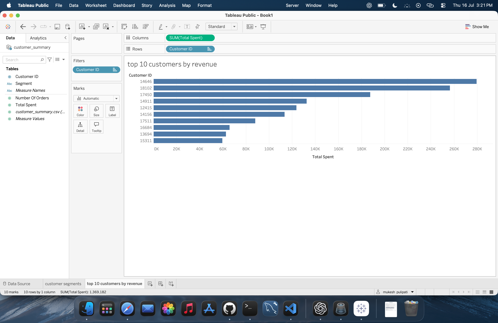
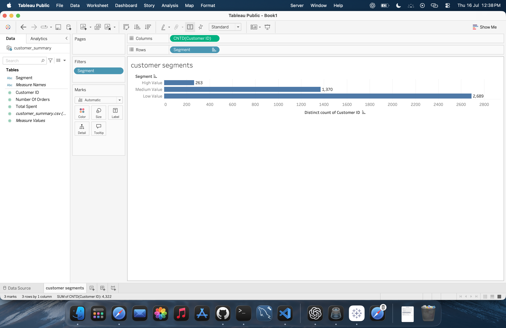

# Retail Customer Insights

An end-to-end analysis of online retail transactions using MySQL, Python, Pandas, and Tableau. The project combines advanced SQL analysis, customer-level insights, segmentation, and visual reporting.

## Project Objectives

- Identify the highest-revenue countries and products
- Measure average order value and monthly revenue trends
- Rank high-value and frequent customers
- Find the top customer in each country
- Calculate each customer’s contribution to total revenue
- Build customer-level summaries for segmentation and Tableau analysis

## Analysis Workflow

1. **MySQL** — Analyse sales, products, countries, and customers
2. **Python and Pandas** — Clean data, aggregate customer metrics, and create customer segments
3. **Tableau** — Visualise high-value customers using the prepared customer summary

## Technologies Used

| Technology | Purpose |
|---|---|
| MySQL | Business analysis and advanced SQL queries |
| Python | Customer-level analysis and data preparation |
| Pandas | Cleaning, aggregation, and segmentation |
| Jupyter Notebook | Reproducible Python analysis |
| Tableau | Customer revenue visualisation |
| Git and GitHub | Version control and project documentation |

## Dataset

This project uses the [UCI Online Retail dataset](https://archive.ics.uci.edu/dataset/352/online%2Bretail), containing transaction-level online retail data.

The source CSV used for this analysis is included as `online_retail.csv`. Revenue analysis uses completed sales with:

- Positive quantities
- Positive unit prices
- Cancelled invoices beginning with `C` excluded

## Repository Structure

```text
retail-customer-insights/
├── sql/
│   └── online_retail_analysis.sql
├── online_retail_analysis.ipynb
├── customer_summary.csv
├── online_retail.csv
├── customer_segments.png
├── top_10_customers_by_revenue.png
└── README.md
```

## SQL Analysis

The SQL script answers ten business questions:

1. Top countries by revenue
2. Top products by quantity sold
3. Top products by revenue
4. Average order value
5. Monthly revenue trend
6. Top customers by revenue using `RANK()`
7. Top customers by order count using `DENSE_RANK()`
8. Top customer in each country using `ROW_NUMBER()`
9. Running total of monthly revenue using `SUM() OVER()`
10. Customer contribution to total revenue

Advanced SQL concepts used include:

- Common Table Expressions
- Window functions
- Ranking functions
- Aggregate functions
- Conditional filtering
- Date-based aggregation

## Python Analysis

The Jupyter notebook performs:

- Data loading and inspection
- Data cleaning
- Revenue calculation
- Customer-level aggregation
- Identification of high-value customers
- Customer segmentation
- Export of `customer_summary.csv` for Tableau

## Visual Results

### Top 10 Customers by Revenue — Tableau



### Customer Segmentation — Python



## How to Run

### SQL

1. Import `online_retail.csv` into MySQL as the `online_retail_full` table.
2. Create or select the `ecommerce_project` database.
3. Name the analysis table `online_retail_full`.
4. Run:

```text
sql/online_retail_analysis.sql
```

### Python

Install the required tools:

```bash
pip install pandas matplotlib jupyter
```

Start Jupyter Notebook:

```bash
jupyter notebook online_retail_analysis.ipynb
```

### Tableau

Connect Tableau to:

```text
customer_summary.csv
```

Use the customer-level fields to reproduce the revenue and segmentation visualisations.